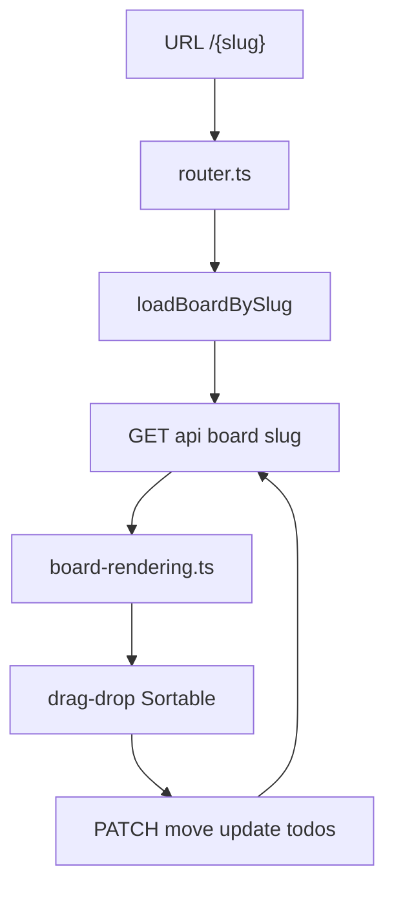
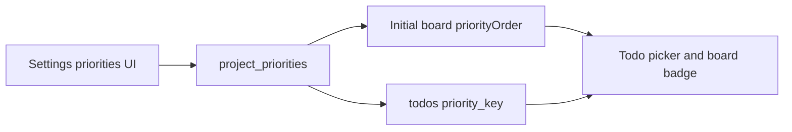
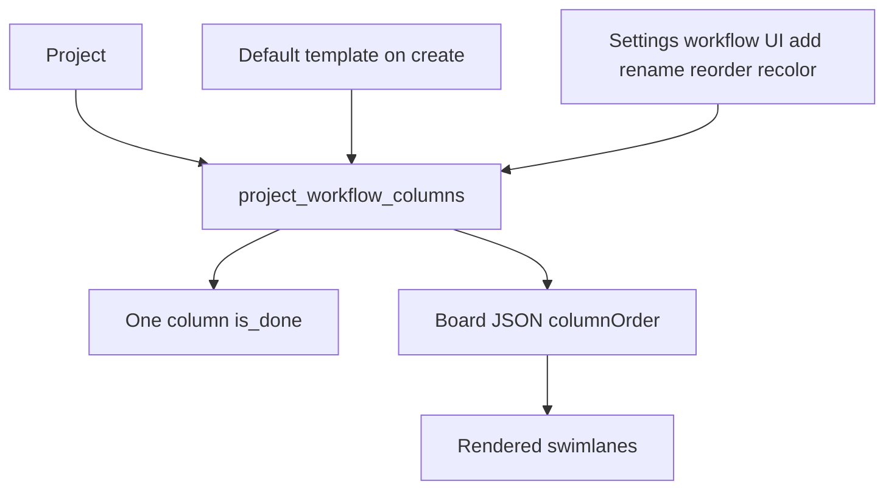
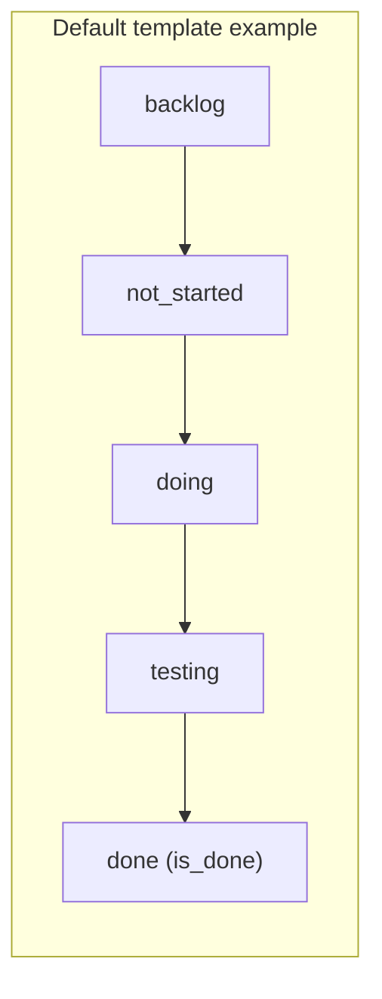

# Board and Kanban UX

Board data flows from slug URL through REST into rendered lanes and drag-drop mutations.

## Priority tiers (per project)

Each board has ordered definitions in `project_priorities`: stable `key`,
display `name`, `#RRGGBB` color, and `position`. Todos store an optional
project-local `priority_key`; cards render the matching tier but board ordering
and filters do not use priority in this release.

Maintainers create, rename, recolor, and delete tiers. A project may have at
most 12 and must keep one; an assigned tier cannot be deleted. Readers can use
`GET /api/board/{slug}/priorities`. Initial slug and legacy board projections
own `priorityOrder` through the application board-read service, while lane
pagination intentionally does not repeat project definitions.

## Workflow columns (per project)

Lanes are **not** hard-coded. Each project stores an ordered list in `project_workflow_columns`: stable `key`, display label, color, sort order, and exactly one `is_done` flag.

Default template keys (example only; boards can diverge):

Projects may add lanes (at most **12** columns; `maxWorkflowColumns` in `internal/store/workflows.go`), rename labels, recolor columns, reorder them, and choose which lane counts as done. Todos reference lanes by `column_key`, not a fixed enum. The default mid-lane display name is “In Progress”; its stable key is `doing` (not `in_progress`).

Lane colors and sprint chips use `styles.css` CSS variables. The server filters board scope via `sprintId` / `tag` / `search` / `assignee` / `priority` query params on `GET /api/board/{slug}` (and lane pagination); the REST `sprintId` query value is a project-local sprint number, and filtering itself is implemented in the store. MCP `board_get.sprintId` intentionally uses the distinct stored sprint row ID returned by `sprints_list`. The SPA preserves these filters in board URLs and exposes assignee, sort, and priority controls alongside the sprint/tag/search chips. On durable projects, the `tag` filter resolves through the same canonical-name grouping as chip listings (`TagGroupKey`). Agile field labels and native `title` hover hints (`field-tooltips.ts`) localize with the active locale.
