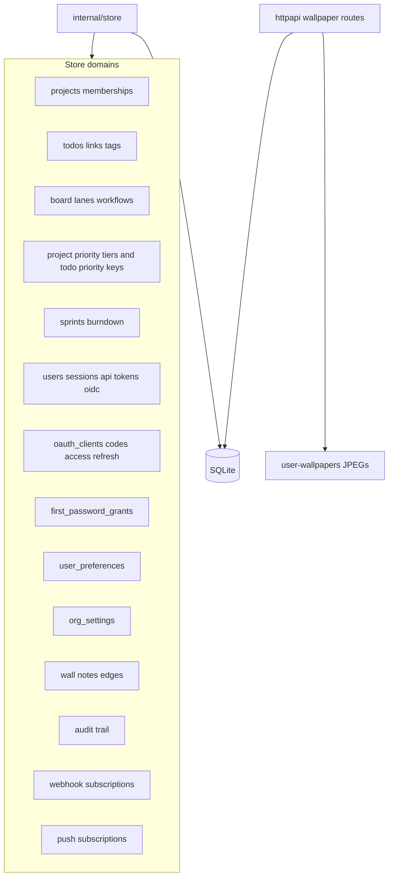
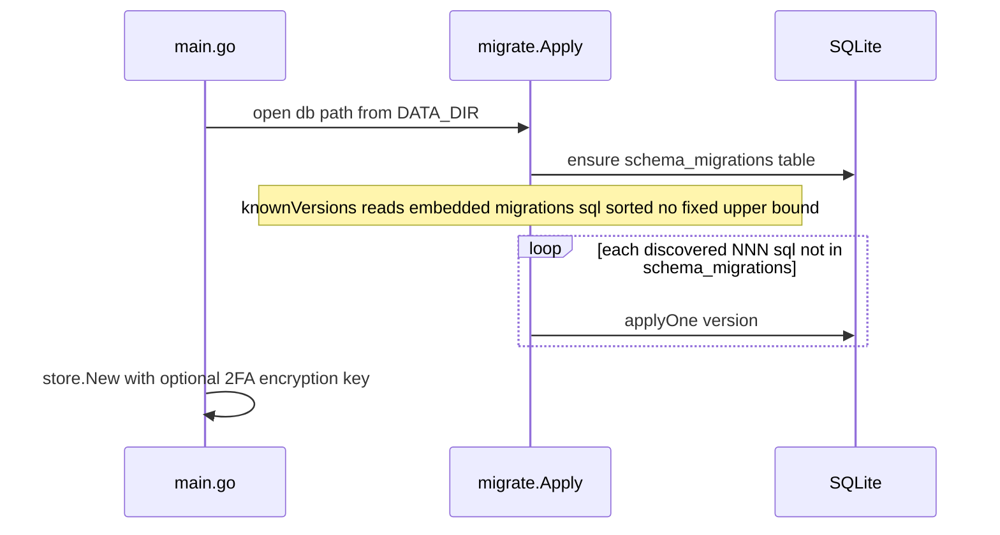

# Data model and persistence

SQLite is the primary store for board, auth, and domain state. Uploaded wallpapers are file-backed under `DATA_DIR/user-wallpapers/` (preference JSON stays in SQLite). `internal/store` owns domain rules; `internal/migrate` applies numbered SQL files discovered from the embedded migrations tree (no fixed upper bound).

Wallpaper preference (`user_preferences` key `wallpaper`) records mode/color/revision in SQLite; the normalized JPEG for image mode lives only on disk at `DATA_DIR/user-wallpapers/<user-id>.jpg`. Preference rows carry a `provenance` column (`legacy` / `org_default` / user-written) so future org bulk-apply can skip customized values.

`org_settings` holds org-wide admin defaults (e.g. seeded `emailNotifications`, default board for new users). Seeds apply at user-creation time only and never rewrite existing preference or membership rows.

OAuth authorization codes and access/refresh tokens (after migration 057) require a non-empty `resource` (canonical MCP audience `<origin>/mcp/rpc`). `oauth_clients` has no resource column. `first_password_grants` references `users(id)` and `sessions(token_hash)`. Expired OAuth artifacts are cleaned by hourly `store.DeleteExpiredOAuthArtifacts`.

## Migration pipeline

As of this tree the highest embedded file is
`064_add_todo_created_by_user_id.sql`. Migration 061 adds the reversible
`projects.sprints_enabled` capability, 062 creates and seeds
`project_priorities`, 063 adds nullable `todos.priority_key`, and 064 adds
nullable `todos.created_by_user_id`. New files
under `internal/migrate/migrations/` are applied automatically; do not encode a
fixed upper bound in the migration runner.

`project_priorities` belongs to one project and has an immutable project-local
`key`, editable `name`/`color`, and contiguous `position`. A todo's nullable
`priority_key` is valid only when the same project owns that tier. Supported
CRUD and import paths enforce this membership invariant; tier deletion is
blocked while in use.

`todos.created_by_user_id` records immutable historical attribution at create
time when an authenticated actor exists. It is not a membership or
authorization grant. Removing a creator from a project leaves the attribution
intact; deleting the user sets it to `NULL`. `NULL` also represents
unauthenticated creation and rows that predate migration 064. The todo dialog
shows the creator only when that identifier currently resolves through the
board's authorized member projection; storage can therefore retain attribution
that the UI intentionally does not display.

Authorization checks live in store methods (`CheckProjectRole`, system roles), not only in HTTP handlers.
