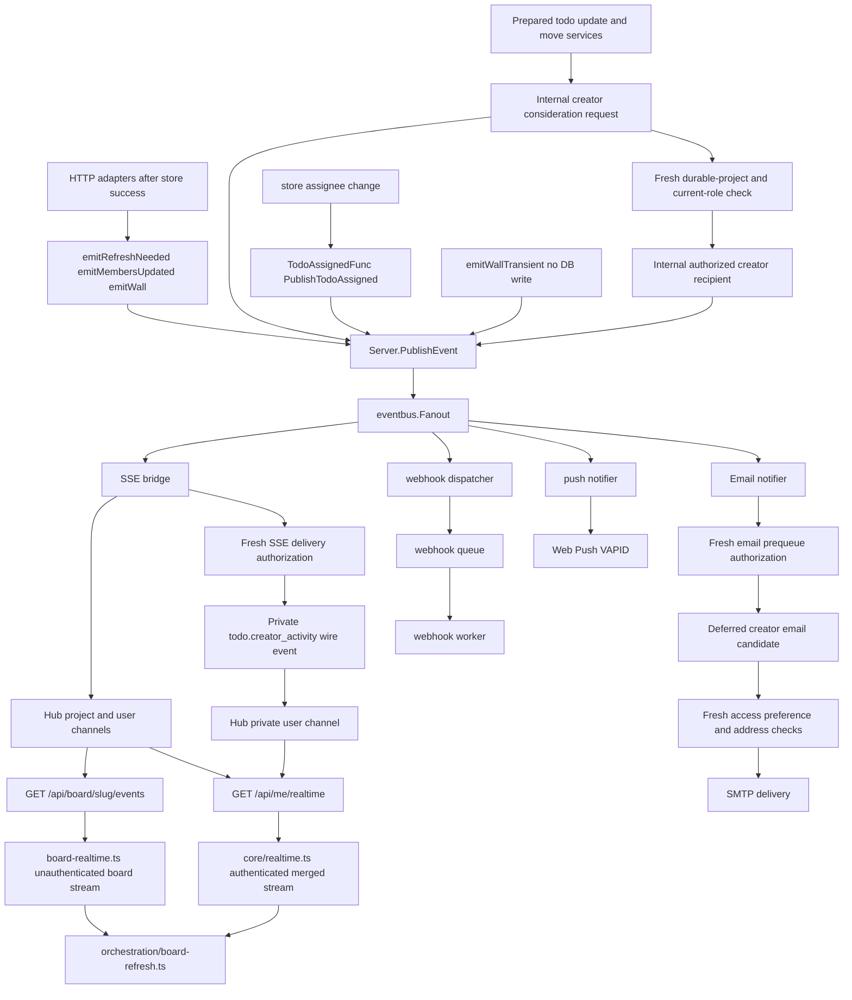

# Realtime events pipeline

Most domain events are published by prepared application services or HTTP adapters after successful store operations (`emitRefreshNeeded`, `emitMembersUpdated`, `emitWallRefreshNeeded`, `emitWallTransient` → `Server.PublishEvent`). Store mutations do not generally publish. Exception: todo assignee changes call `store.TodoAssignedFunc` set via `SetTodoAssignedPublisher(srv.PublishTodoAssigned)` in `main.go`.

Prepared REST, legacy numeric REST, and MCP todo update/move services may also publish `todo.creator_notification_requested` after a committed mutation. This internal request nominates the historical creator but does not authorize or deliver anything. A creator-specific service then re-reads the durable project and the creator's current project role. Only a viewer-or-higher current member produces `todo.creator_notification_recipient_authorized`, a point-in-time internal decision that still does not represent preferences, queueing, sending, or delivery. Both internal events are excluded from webhooks and are never emitted verbatim to browsers.

The SSE bridge consumes the authorized-recipient event as a candidate, repeats the durable-project and current-role lookup with the fanout context, and fails closed if access changed or lookup was cancelled/failed. Only that second check can emit the factual `todo.creator_activity` wire event, and it is emitted exclusively to the recipient's private user channel. Its minimum-disclosure payload omits both actor and recipient user IDs. The frontend turns it into a localized toast only.

The email notifier independently consumes the authorized-recipient event for material mutations. A non-blocking fresh access check must succeed before it queues deferred creator work with no destination or rendered project/card content. At each SMTP attempt the worker checks current durable-project access again, then the master preference and the already-selected `Assigned > CreatedByMe > CardActivity` category, and the current email destination before rendering. The category cannot change across retries. Assignment overlap uses private transaction-authoritative creator/durable-project facts carried by the existing store assignment publication rather than rereading the todo; the facts are not serialized in `todo.assigned`. A selected `CardActivity` fallback shares the existing activity debounce, while retries of the same work retain their debounce claim. MCP still publishes no `board.refresh_needed`, so it has no ordinary card-activity fallback. Creator Web Push and webhook delivery remain absent.

## SSE transport

| Client context | Endpoint | Module |
|----------------|----------|--------|
| Authenticated user | `GET /api/me/realtime` | `core/realtime.ts` (merged user + accessible projects) |
| Unauthenticated board client | `GET /api/board/{slug}/events` | `board-realtime.ts` (per-board; also temp/share-style boards in full mode) |

Both paths share `sse-client.ts` for the EventSource connection.

## Common event types

| Event | Typical consumer |
|-------|------------------|
| `board.refresh_needed` | SSE to browsers on that project |
| `board.members_updated` | SSE plus membership UI refresh |
| `todo.assigned` | Push notification to assignee; also on merged user stream |
| `todo.creator_notification_requested` | Internal consideration only; excluded from direct SSE/email delivery, push, and webhooks |
| `todo.creator_notification_recipient_authorized` | Internal point-in-time candidate consumed independently by fresh SSE and creator-email delivery gates; never emitted verbatim and excluded from push and webhooks |
| `todo.creator_activity` | Private user-channel SSE wire event after delivery-time reauthorization; localized toast only |
| `wall.refresh_needed` | Wall canvas full refetch |
| `wall.transient` | Ephemeral drag/move only (`emitWallTransient`); not a durable store mutation; SSE wire only |
