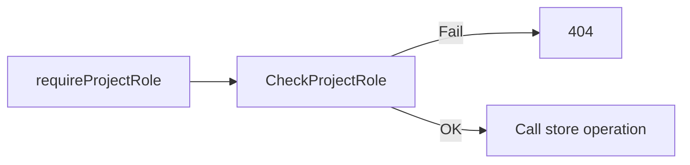

# Roles and Permissions

## System Roles vs Project Roles

**System roles** (Owner, Admin, User) govern system-level permissions such as user management and admin APIs.

**Project roles** (Maintainer, Contributor, Viewer) govern project-level permissions and are stored in the `project_members` table.

**Important:** System roles (Owner, Admin, User) **never** grant project permissions. Project access is solely via `project_members`. A system Admin or Owner cannot access, modify, or delete a project without an explicit project membership.

---

## Project Role Hierarchy

| Role        | Rank | Description                                                                 |
|-------------|------|-----------------------------------------------------------------------------|
| Viewer      | 1    | Read-only: view board, todos, members                                       |
| Contributor | 2    | Body-only edit when assigned; no create, delete, move, or assign. Create tags. |
| Maintainer  | 3    | Project metadata, members, sprints, assign others, full todo CRUD           |

*Editor is deprecated; merged into Contributor. Owner is deprecated (Phase 2); migrated to Maintainer.*

---

## Backend Authorization (Store Layer)

| Action                         | Required Role | Notes                                  |
|--------------------------------|---------------|----------------------------------------|
| View project, board, todos     | Viewer+       |                                        |
| List project members           | Viewer+       | Response: userId, name, image, role (no email) |
| Create todo                    | Maintainer    |                                        |
| Edit todo (title, body, tags, sprint, estimation) | Maintainer | Except body when assigned (see below)   |
| Edit body when assigned        | Contributor   | Body-only; no title, tags, sprint, assign |
| Move todo                      | Maintainer    |                                        |
| Delete todo                    | Maintainer    |                                        |
| Self-assign todo               | Maintainer    | Contributor cannot self-assign          |
| Assign todo to others          | Maintainer    |                                        |
| Create tags                    | Contributor+  |                                        |
| Delete project                 | Maintainer+   |                                        |
| Update project name/image      | Maintainer+   |                                        |
| Update default sprint weeks    | Maintainer+   |                                        |
| Add/remove members             | Maintainer+   | Last maintainer cannot be removed      |
| List available users (add UI)  | Maintainer+   |                                        |
| Sprints CRUD (create/activate/close) | Maintainer+ | Via board settings                      |
| Configure Agenda / ICS feeds   | Maintainer+   | Durable projects; URLs stored encrypted |
| List priority tiers              | Viewer+       | Same definitions shown on the board     |
| Create/update/delete priority tiers | Maintainer+ | Last and in-use tiers cannot be deleted |
| Assign/clear todo priority       | Maintainer    | Key must belong to the todo's project   |

---

## Permission Architecture

Permissions flow: `permissions.go` → store enforcement → API error mapping → UI affordances.

- **Backend is authoritative:** Store methods enforce role checks; API returns 401/404 on failure.
- **UI hides controls:** Contributors do not see create, delete, move, assign, or title/tag/sprint controls. Body-only edit is shown when assigned.

---

## Anonymous Temporary Boards

**Definition:** Projects with `expires_at IS NOT NULL` and `creator_user_id IS NULL`. Share-link style; no authentication required.

**Bypass rules:**
- Create, delete, move todos: allowed without auth
- Rename project: allowed without auth (active boards only; past `expires_at` → 404)
- Assignment: not allowed (validation error)
- Project image, delete project: immutable (404)

**Expiration:** Temporary boards use `expires_at` (initially 90 days from
creation; board activity can roll the expiry forward). Read-triggered activity
refresh is throttled and best-effort, so a successful board response does not
guarantee that the maintenance write persisted; failures are logged by the
server. Once `expires_at` is in the past, board reads and mutations return
**404** until the project row is removed. This applies to authenticated
temporary boards in full mode as well as unowned anonymous boards.

**UI:** New Todo and drag-and-drop are enabled for anonymous boards (same as Maintainer on durable boards).

---

## UI Visibility (Board Topbar)

| Element          | Visible To                              |
|------------------|-----------------------------------------|
| New Todo         | Maintainer, or anonymous temp board     |
| Drag-and-drop    | Maintainer, or anonymous temp board      |
| Members button   | Maintainer, Contributor                 |
| Delete Project   | Maintainer (durable boards only)        |

**Members dialog:**
- **Maintainer:** Full UI — member list, add form, remove buttons
- **Contributor:** View-only — member list (name + role), no add/remove

---

## Settings Dialog Tabs

This table is **Settings tab visibility** in the SPA (`modules/dialogs/settings.ts` / `renderSettingsModal`), not the system-role or project-role permission matrices above.

| Tab | Visible when |
|-----|----------------|
| Profile | Full mode (auth status available) |
| Users | Full mode **and** system role Admin or Owner |
| Sprints | Board view (`slug` set) **and** project role Maintainer |
| Workflow | Board view **and** project role Maintainer |
| Priorities | Board view **and** project role Maintainer |
| Customization | Always when Settings is open |
| Tag Colors | Always when Settings is open (replaces older “Tags” label) |
| Charts | Board view, full mode, **and** durable project (not temporary/anonymous expiry boards) |
| Backup | Always when Settings is open |

Contributor/Viewer on a durable board typically see Customization, Tag Colors, Charts, and Backup (not Sprints/Workflow/Priorities). Anonymous/temporary boards omit Charts; Profile/Users require full mode.

---

## Org-Wide Default Board For New Users

Admins/owners can configure a single org-wide default board: newly created users (via
`CreateUser` or `CreateUserOIDC`) are auto-enrolled as **Viewer** (the lowest-appropriate
project role) on that project, in the same transaction as user creation. This follows the same
`org_settings` shape as the [email-notification org default](notifications.md#org-wide-default-for-new-users)
from #169/#171.

- **Endpoints:** `GET`/`PUT`/`DELETE /api/admin/settings/default-board`, gated the same as other
  `/api/admin/*` routes (system role Admin or Owner). `PUT` body: `{ "projectId": <number> }`.
  The selected project must currently exist, must be a **durable** project (`expires_at IS NULL`;
  Full-mode Temporary Boards and creator-less Anonymous Boards are rejected), and the requester
  must also be a **Maintainer** of that project. Missing or inaccessible projects return **404**
  (no existence leak). Existence, durability, and maintainer checks run in the same transaction
  as the `org_settings` write. `DELETE` resets to unconfigured (`204`, idempotent).
- **Seed at creation time only:** setting or changing the default never touches existing users'
  memberships. Only users created *after* the setting takes effect are enrolled. Unset (no
  override, or a later `DELETE`) means no membership is seeded at all — an untouched instance
  behaves exactly as before this feature existed. Creation-time seeding also requires the
  configured project to still be durable (`expires_at IS NULL`); otherwise seeding is skipped.
- **Bootstrap owner excluded:** the first (bootstrap) user is never auto-enrolled. System roles
  do not grant project access; when the bootstrap owner creates a board via `CreateProject`, that
  path inserts their Maintainer membership — which is unrelated to default-board seeding.
- **Deleted-project safety:** if the configured project is deleted after the setting was made,
  account creation still succeeds; seeding is silently skipped rather than failing user creation.
- **Admin UI (Settings → Users):** Admins/Owners manage this from a "Default board for new users"
  section at the top of the Users tab. An enable toggle is **off by default**; turning it on reveals
  a project dropdown listing only durable boards the requester maintains. Selecting a project saves
  it (`PUT`); turning the toggle off clears the setting (`DELETE`). The UI never enrolls existing
  users and states that changing or disabling the default only affects users created afterward.
- Out of scope for phase 1: any bulk-apply-to-existing-users action.

---

## Access-Denied Response: 404 Only

For project resources, access denial must return **404** (not 403). Returning 403 would leak project existence. Always return 404 when the user lacks project access.

